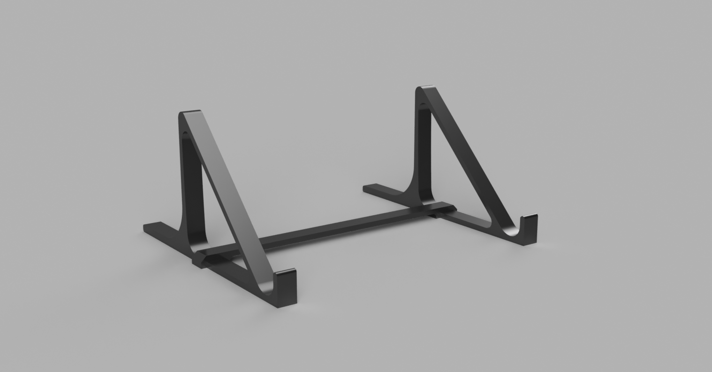

# Laptop Stand

A fixed, 45 degree stand. This version with the retainer bar is currently under test, but printing each stand individually without the bar holds an XPS 13 (2016) with its hinge opened to the maximum.

Recommended printer settings (0.4mm nozzle):

    Perimeters: 5
	Infill percentage: 0%

N.B. 2 perimeters might be worth trying, but 3-4 perimeters with infill result in small zig-zag fill areas, which tend to cause blobbing on the exterior of the print)

(The following are 0.20mm normal Prusa3d settings for the i3 MK2 using Slic3r)

    Layer height: 0.2mm
    Top solid layers: 6
    Bottom solid layers: 5
    Fill pattern: cubic
    Top/bottom fill pattern: Rectilinear
    Supports: None

# Optional hardware

The retainer bar takes M3 screws for more security, and is configured to accept
brass inserts.
