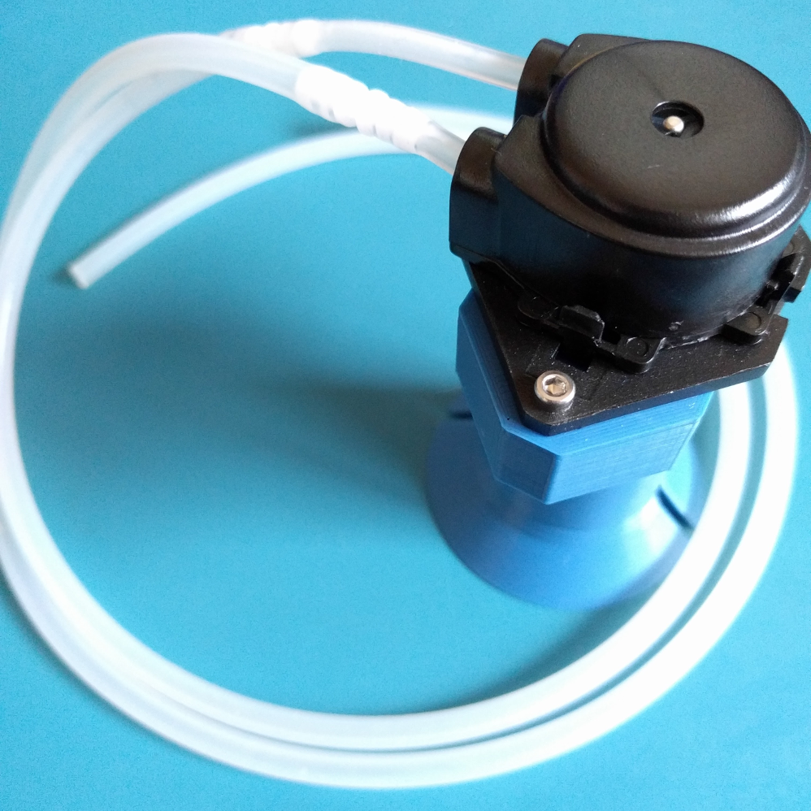

# Peristaltic Pump Stand

This is a stand for a generic 12v peristaltic pump (available from many vendors). The particular peristaltic pump used and fitted to this case [is this one](https://www.adafruit.com/product/1150).

Bill of Materials/Required Hardware: 

* 2x M2.5x16 Socket Cap Screw (source: [Trimcraft RC](https://www.trimcraftaviationrc.com/index.php?route=product/product&product_id=199))

* 2x M2.5 Nylon Lock Nuts (source: [Trimcraft RC](https://www.trimcraftaviationrc.com/index.php?route=product/product&product_id=237))

For best success, dry fit the bolts+nylocks to ream the holes out prior to installing the pump, as printer tolerances may be quite different from machine to machine.

If available, small zip ties may also work fairly well.